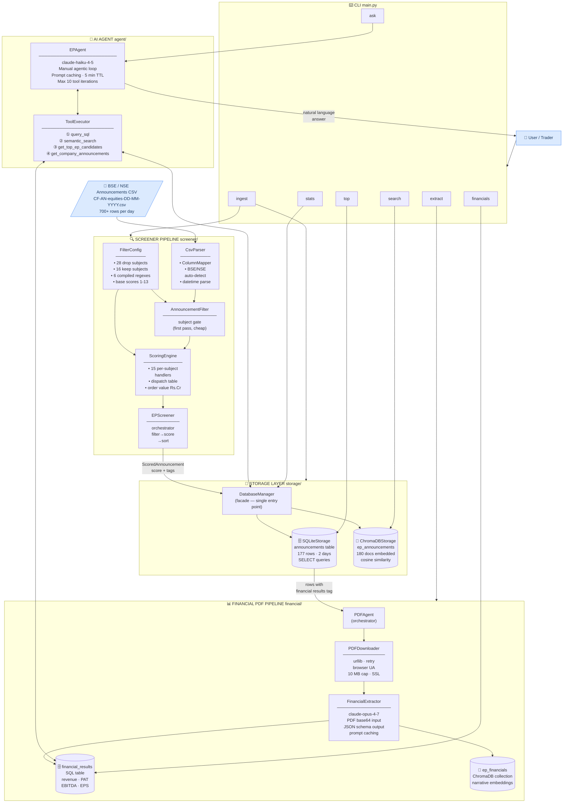
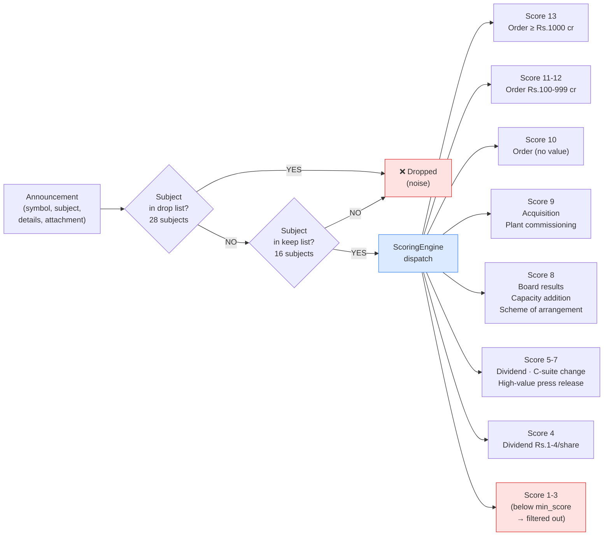
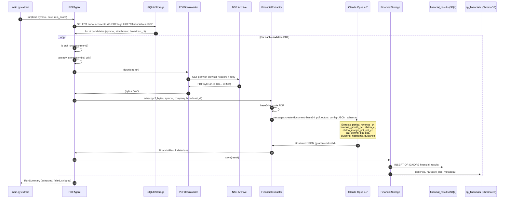
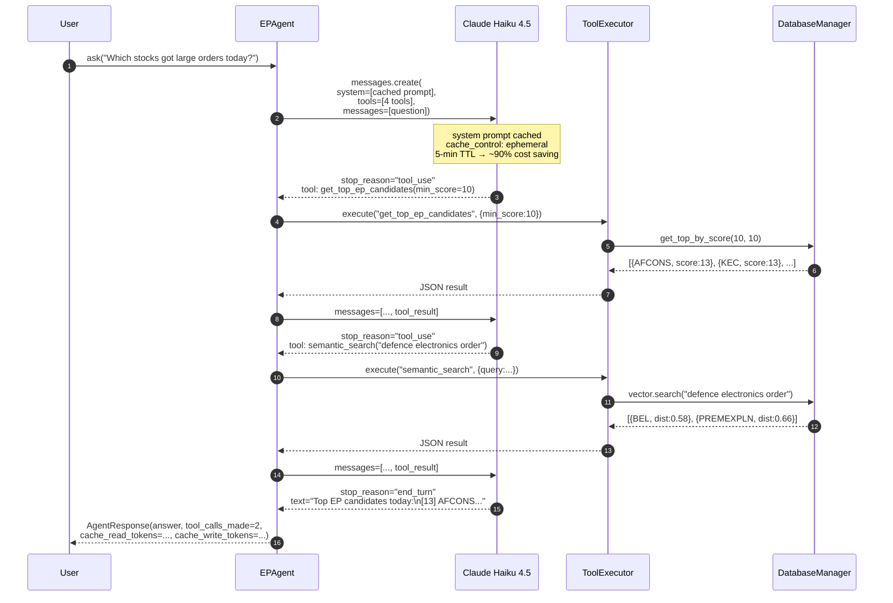
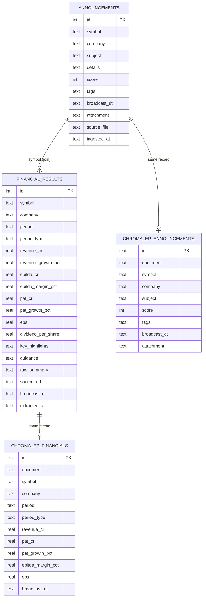

# EP News Screener — Architecture

---

## 1. System Overview



---

## 2. Screener Scoring Logic



---

## 3. Financial PDF Extraction Flow



---

## 4. AI Agent Tool-Use Loop



---

## 5. Data Model



---

## 6. File Structure

```
ep_news/
│
├── main.py                        ← CLI entry point (7 commands)
├── config.py                      ← AppConfig  (env vars)
├── models.py                      ← Shared dataclasses
│
├── screener/                      ── SCREENER PIPELINE ──────────────
│   ├── filter_config.py           ← FilterConfig (frozen, regexes)
│   ├── csv_parser.py              ← ColumnMapper + CsvParser
│   ├── scoring_engine.py          ← AnnouncementFilter + ScoringEngine
│   └── pipeline.py                ← EPScreener (orchestrator)
│
├── storage/                       ── STORAGE LAYER ──────────────────
│   ├── base.py                    ← BaseStorage (ABC)
│   ├── sql_storage.py             ← SQLiteStorage
│   ├── vector_storage.py          ← ChromaDBStorage
│   └── database_manager.py        ← DatabaseManager (facade)
│
├── financial/                     ── FINANCIAL PDF PIPELINE ─────────
│   ├── models.py                  ← FinancialResult + ExtractionStatus
│   ├── pdf_downloader.py          ← PDFDownloader (urllib + retry)
│   ├── extractor.py               ← FinancialExtractor (Claude)
│   ├── storage.py                 ← FinancialStorage (SQL + ChromaDB)
│   └── pdf_agent.py               ← PDFAgent (orchestrator)
│
├── agent/                         ── AI AGENT LAYER ─────────────────
│   ├── tools.py                   ← TOOL_DEFINITIONS + ToolExecutor
│   └── ep_agent.py                ← EPAgent (Claude agentic loop)
│
├── data/                          ── PERSISTENT DATA ────────────────
│   ├── ep_news.db                 ← SQLite (announcements + financials)
│   └── chroma/                    ← ChromaDB (ep_announcements + ep_financials)
│
├── requirements.txt
└── .env
```

---

## 7. Technology Choices

| Layer | Local / Dev | Production Upgrade |
|---|---|---|
| **SQL** | SQLite (zero-config, file-based) | PostgreSQL — change connection string only |
| **Vector / RAG** | ChromaDB (persistent, local) | Qdrant (Docker / cloud) |
| **Scraper model** | claude-haiku-4-5 (fast, cheap) | claude-opus-4-7 (better accuracy) |
| **Extraction model** | claude-opus-4-7 (accuracy first) | Keep as-is |
| **PDF download** | urllib (stdlib, no deps) | aiohttp for async parallel downloads |

---

## 8. Cost Optimisations

| Technique | Where used | Effect |
|---|---|---|
| **Prompt caching** (`cache_control: ephemeral`) | EPAgent system prompt, FinancialExtractor system prompt | ~90% cost reduction on repeated queries |
| **Subject gate first** | AnnouncementFilter before ScoringEngine | Drops ~80% of rows before regex matching |
| **Frozen FilterConfig** | All regexes compiled once at startup | Zero re-compilation per announcement |
| **INSERT OR IGNORE** | SQLiteStorage + ChromaDB upsert | Safe to re-ingest same CSV — no duplicates |
| **claude-haiku-4-5 for agent** | EPAgent Q&A loop | $1/M tokens vs $5/M for Opus |
| **claude-opus-4-7 for extraction** | FinancialExtractor | Accuracy over cost for one-time PDF parse |
